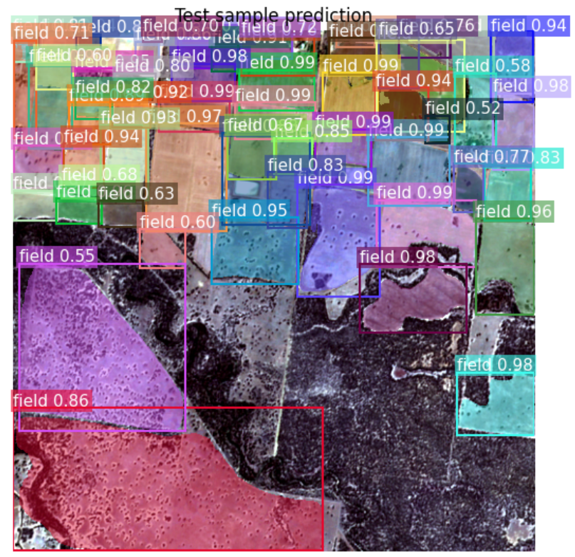

<p align="center">
  
</p>
<h1 align="center">🌾 Dynamic Farmland Boundary Detection Engine</h1>

---

<p align="center">
  
  
  
  
  
</p>

---

## 🌱 Project Overview

This project develops an automated system for detecting dynamic sub-field boundaries within farmland parcels across New South Wales, Australia. By leveraging Sentinel-2 multispectral imagery, NDVI calculation, and a Mask R-CNN segmentation model, the system identifies intra-field variations and produces annual farmland boundary maps.

---

## 🚀 Key Features
- 🛰️ **Sentinel-2 NDVI & Automatic Patch Segmentation preprocessing pipeline**
- 🧠 **Deep learning model** based on Mask R-CNN for boundary detection  
- ⚙️ **Post-processing with exporting and splicing target polygons**
- 📦 **Outputs in appropriate format for GIS visualization**

---

## 🧭 System Workflow
1. Data acquisition from **Sentinel-2 Image**  
2. NDVI computation and cloud masking  
3. Patch generation and model training  
4. Post-processing and boundary binarisation  
5. Visualization in QGIS  

---

## 📊 Model Architecture
<p align="center">
  
</p>

> Loss Function: A weighted BCE + Dice composite loss, combining classification, regression, and segmentation objectives for better boundary accuracy.
> Optimizer: Adam (lr = 1e-4)  
> Epochs: 20 
> weight_decay: 1e-4

---

## 💻 Usage

> This project uses **two Conda environments** and an additional **Google Earth Engine (GEE) JavaScript** for preprocessing. The two environment.yml files can be found in the environment folder. 
> - `Patch.yml` → **patch-env** (patch generation)  
> - `Mask-R-CNN.yml` → **model-env** (training & inference)
> - `Farmland_identification.js`  → **GEE script** (farmland identification)

 If your PC's operating system is MacOS or Linux, maybe you can directly use the yml file to install the environment, otherwise you may be install the packages in the following steps:

---

### 1️⃣ Clone the repository
```bash
git clone https://github.com/XinyiHe67/Dynamic-field-boundary-detection.git
```
### 2️⃣ Creat the necessary environment

#### 🟢 Patch generation environment
~~~bash
conda create -n geoenv python=3.12.4
conda activate geoenv
pip install torch==2.8.0 torchvision torchaudio --index-url https://download.pytorch.org/whl/cpu
conda install -c conda-forge pandas==2.3.2 geopandas==1.1.1 pyproj==3.7.2 shapely==2.1.1 fiona==1.10.1
conda install -c conda-forge rasterio
conda install -c conda-forge ipykernel
python -m ipykernel install --user --name=geoenv --display-name "Python (geoenv)"
~~~

#### 🔵 Model training environment

~~~bash
conda create -n modelenv python=3.12
conda activate modelenv
pip install torch==2.8.0+cu129 torchvision==0.23.0+cu129 --index-url https://download.pytorch.org/whl/cu129
pip install -U pillow matplotlib rasterio
pip install -U shapely
pip install -U opencv-python
pip install -U geopandas fiona pyproj rtree
pip install -U scikit-learn
~~~
⚠️ <mark>Please make sure that your NVIDIA GeForce driver is ≥ 550.</mark>

After installing these two environments, you can normally run the code file in this project.

### 3️⃣ VScode-ssh configuration
> [IMPORTANT]
Please install on your local machine first: **VS Code** and the extensions **Remote-SSH**, **Python**, **Jupyter**

Click on your Remote Resource Manager and add the new ssh.
<p align="center">
  
</p>
Then input: ssh -p 43265 root@region-9.autodl.pro and press the enter.

Then enter the first row as follows:

<p align="center">
  
</p>

📝 **Tip:** Choose your user SSH configuration file, e.g.  
`C:\Users\<username>\.ssh\config`

Then please open your SSH configuration file which is stored in the `C:\Users\<username>\.ssh\config` and add the identity key in your configuration file as follows:
<p align="center">
  
</p>

Then we can open the new window to connect the ssh (you can also connect the ssh in the current windows if you have the local files).
<p align="center">
  
</p>
Then choose the Linux operating system and input the password: y3ZoCSWGGfZw in the new window.
Now we can open the folder in this new window and input the password again.
Currently, we can use this new window(which connects the Autodl) to run our code.
<p align="center">
  
</p>


### 📸 Sample Pipeline Outputs

| Input Patch | Detected Sub-field | Outlined Boundaries |
|:---:|:---:|:---:|
|  |  |  |


